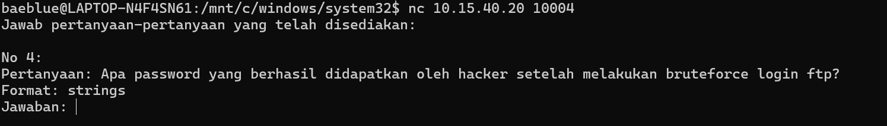

# Laporan Resmi Praktikum Jarkom - Modul 1 - IT07 - 2024

## Pendahuluan

Pada Modul 1 ini, praktikum dilaksanakan melalui platform CTFd dengan tampilan platform adalah sebagai berikut

Terdapat 10 soal CTF dengan setiap soalnya diharuskan untuk mencari sebuah flag unique yang didapatkan dengan menjawab pertanyaan setiap soal berdasarkan data permintaan soal. Data didapatkan berdasarkan hasil analisis pada sebuah file `.pcap / .pcapng` (disediakan pada setiap soal) menggunakan tool wireshark.

## Pembahasan Soal

IT07 berhasil menjawab 7 dari 10 soal dengan benar, namun terdapat dua soal tambahan yang juga berhasil ditemukan jawabannya setelah waktu habis, kedua soal tersebut juga akan ditambahkan pada pembahasan soal ini. Berikut merupakan pembahasannya

### Soal 01 - evidence

### Soal 02 - ATM or ATP or FTP ? 🤔

#### Langkah Pengerjaan

1. Buka wsl lalu masukan nc nya untuk melihat soal yang ingin ditanyakan. disini ditanyakan password yang berhasil didapatkan oleh hacker setelah melakukan bruteforce login.
   

2. Buka file soal lalu lakukan filter dengan command `ftp && ip.src==10.15.40.20` untuk melihat paket-paket yang berasal dari ip tersebut.
   

3. Cari hingga menemukan tulisan `Login sucessful`
4. lalu klik follow tcp stream untuk melihat isi datanya. disitu akan terlihat password yang digunakan
   

5. Tuliskan jawaban yang didapat ke terminal lalu akan didaptkan flagnya.
   

### Soal 03 - How Many packets?

### Soal 04 - trace him

### Soal 05 - creds

### Soal 06 - malwleowleo

### Soal 07 - whoami

### Soal 08 - secret

Text here

### Soal 09 - fuzz

Text here
