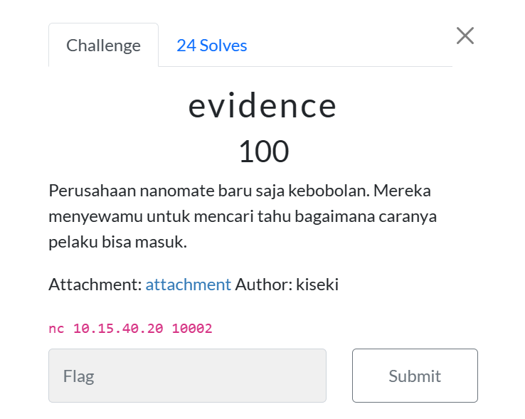
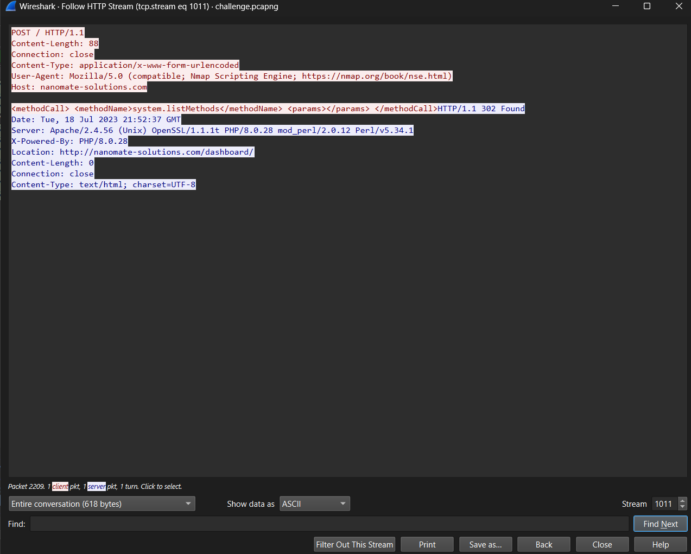
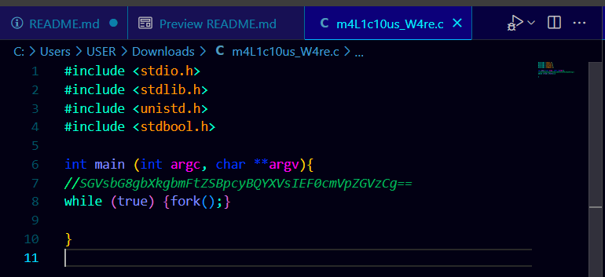

# Laporan Resmi Praktikum Jarkom - Modul 1 - IT07 - 2024

## Pendahuluan

Pada Modul 1 ini, praktikum dilaksanakan melalui platform CTFd dengan tampilan platform adalah sebagai berikut

Terdapat 10 soal CTF dengan setiap soalnya diharuskan untuk mencari sebuah flag unique yang didapatkan dengan menjawab pertanyaan setiap soal berdasarkan data permintaan soal. Data didapatkan berdasarkan hasil analisis pada sebuah file `.pcap / .pcapng` (disediakan pada setiap soal) menggunakan tool wireshark.

## Pembahasan Soal

IT07 berhasil menjawab 7 dari 10 soal dengan benar, namun terdapat dua soal tambahan yang juga berhasil ditemukan jawabannya setelah waktu habis, kedua soal tersebut juga akan ditambahkan pada pembahasan soal ini. Berikut merupakan pembahasannya

### Soal 01 - evidence

#### Langkah Pengerjaan

1. Masuk pada terminal melalui `nc 10.15.40.20 10002` (tertera pada soal) untuk mengetahui data apa saja yang diperlukan pada soal ini.

Tampak bahwa data pertama yang diperlukan untuk menyelesaikan soal ini ialah domain dari perusahaan yang diserang.

2. Gunakan wireshark untuk melakukan analisis stream yang diberikan, lalu gunakan filter `_ws.col.protocol == "HTTP"` agar tampilan hanya menampilkan stream dengan protocol HTTP saja. Hal ini diperlukan karena di sini attacker melakukan brute force login pada laman HTTP.

Tampilan tersebut menunjukkan 1163 stream yang ditampilkan setelah melakukan filter

3. Kemudian, karena login merupakan bentuk interaksi POST pada HTTP, kita amati salah satu stream POST yang terdapat di bagian paling atas.

Dari satu stream ini kita dapat menemukan host dari koneksi HTTP tersebut adalah `nanomate-solutions.com`, kita juga menemukan informasi tambahan berupa server website yang digunakan oleh perusahaan nanomate yaitu `apache/2.4.56`. Nama server yang kita temukan akan digunakan pada pertanyaan kedua dari soal ini

4. Masukkan dua jawaban pertama pada terminal, karena permintaan dari soal untuk bagian nama server berupa `name-version`, maka nama server yang sudah ditemukan sebelumnya diubah menjadi `apache-2.4.56`.

Setelah mendapatkan konfirmasi bahwa kedua jawaban pertama kita bernilai benar, pengerjaan berlanjut pada pertanyaan ketiga dan keempat.

5. Gunakan filter `frame ~ "success"` untuk menampilkan stream yang mengandung kata tersebut. Umumnya login yang berhasil selalu diikuti dengan kata success pada message-nya. Lakukan analisis pada beberapa stream HTTP pertama dan ditemukan salah satunya memiliki line text/html bertuliskan `Login Successful`

6. Lakukan filter sekali lagi, kali ini dengan menggunakan `frame ~ "login successful"`. Terdapat 4 stream yang ada, lakukan analisis stream satu per satu

7. Saat melakukan follow stream pada stream paling pertama, di dapat informasi sebagai berikut

Dari sana tampak bahwa POST request dilakukan pada path `/app/includes/process_login.php` menggunakan email `tareq@gmail%2ecom` (menurut [wikipedia](https://en.wikipedia.org/wiki/Percent-encoding), `%2e` berarti titik, maka niali sebenarnya dari email tersebut adalah `tareq@gmail.com`) dan password `tareq@nanomate`

8. Masukkan jawaban yang ditemukan pada pertanyaan terminal

Flag didapatkan

### Soal 02 - ATM or ATP or FTP ? 🤔

#### Langkah Pengerjaan

1. Buka wsl lalu masukan nc nya untuk melihat soal yang ingin ditanyakan. Disini ditanyakan password yang berhasil didapatkan oleh hacker setelah melakukan bruteforce login.
   

2. Buka file soal lalu lakukan filter dengan command `ftp && ip.src==10.15.40.20` untuk melihat paket-paket yang berasal dari ip tersebut.
   

3. Cari hingga menemukan tulisan `Login sucessful`
4. lalu klik follow tcp stream untuk melihat isi datanya. disitu akan terlihat password yang digunakan
   

5. Tuliskan jawaban yang didapat ke terminal lalu akan didaptkan flagnya.
   

### Soal 03 - How Many packets?

#### Langkah Pengerjaan

1. Karena setiap kali percobaan login dilakukan user juga harus melakukan input password, maka lakukan filter dengan memasukkan response berupa permintaan untuk mengisi password sebagai parameternya. dengan melakukan sedikit analisis permukaan, ditemukan bahwa bentuk response yang dicari adalah `Response: 331 Please specify the password`. Sehingga filter yang digunakan adalah sebagai berikut `_ws.col.info == "Response: 331 Please specify the password."`

Dari filter yang telah dilakukan, di kanan bawah terlihat ada berapa jumlah stream yang ter-display saat filter diberlakukan. Pada saat ini terlihat bahwa terdapat `934` stream yang terdisplay, hal tersebut berarti bahwa terdapat 934 percobaan login pada stream ini.

2. Masukkan jawaban pada pertanyaan terminal dan dapatkan flagnya

Flag ditemukan

### Soal 04 - trace him

#### Langkah Pengerjaan

1.  Buka wsl lalu masukan nc nya untuk melihat soal yang ingin ditanyakan. Disini, kita disuruh untuk melacak ip attacker tersebut.
    

2.  Buka file soal lalu lakukan filter di wireshark dengan command `ftp && ip.dst==10.15.40.20` untuk melihat paket-paket yang menuju ip tersebut.
    

3.  Disitu terlihat bahwa source IP nya adalah `10.30.3.4`.
    

4.  Dengan begitu, kita sudah mendapatkan Ip penyerang tersebut. Masukan jawabannya ke terminal dan flagnya akan ditemukan.
    

### Soal 05 - creds

#### Langkah Pengerjaan

1. Karena pada soal dijelaskan bahwa server berbentuk FTP, maka lakukan filter pada protocol ftp

2. Lakukan follow pada salah satu stream yang memiliki info `request`

Dari sana ditemukan bahwa attacker sukse melakukan login dengan kredensial USER `h3ngk3rTzy` dan PASS `S!l3ncE`.

3. Masukkan jawaban sesuai format pada pertanyaan terminal dan dapatkan flagnya

Flag ditemukan

### Soal 06 - malwleowleo

#### Langkah Pengerjaan

1. Buka wsl lalu masukan nc nya untuk melihat soal yang ingin ditanyakan. Disini, kita disuruh untuk mencari nama malware yang dikirim oleh attacker ke korban.
   

2. Buka file soal lalu lakukan filter di wireshark dengan command `ftp && ip.dst==10.15.40.20` untuk melihat paket-paket yang menuju ip tersebut.
   

3. Cari nama file malware yang dikirimkan oleh attacker, disini didapatkan nama filenya adalah `m4L1c10us_W4re.c`
   

4. Masukan jawabannya ke terminal dan flagnya akan ditemukan.
   

### Soal 07 - whoami

#### Langkah Pengerjaan

1. Buka wsl lalu masukan nc nya untuk melihat soal yang ingin ditanyakan. Disini, kita disuruh untuk mencari nama attacker yang sudah melakukan serangan tersebut.
   

2. Untuk mencari nama attacker tersebut, kita perlu mendownload file malware yang telah dikrimkan oleh attacker.
   

3. Buka file .c yang sudah didowload tadi lalu akan didapatkan teks yang terenkripsi dalam format base64, yaitu `SGVsbG8gbXkgbmFtZSBpcyBQYXVsIEF0cmVpZGVzCg==`.
   

4. Open browser untuk decode teks dengan format base64 tersebut. Lalu akan didapatkan nama attackernya, yaitu _Paul Atreides_
   

5. Masukan nama attacker ke dalam terminal lalu dapatkan flagnya.
   

### Soal 08 - secret

#### Langkah Pengerjaan

1. Buka wsl lalu masukan nc nya untuk melihat soal yang ingin ditanyakan. Disini, kita disuruh untuk mencari pesan yg dikutip oleh attacker.
   

2. Download file lainnya yang dikirim oleh attacker selain file malware. Disini ditemukan file `mirza.jpg`.
   

3. Setelah mendownload, buka filenya lalu akan ditemukan pesan dalam tanda kutip, yaitu "MIO MIRZA".
   

4. Masukan jawaban yang telah didapatkan ke terminal lalu dapatkan flagnya.
   

### Soal 09 - fuzz

#### Langkah Pengerjaan

### Soal 10 - malwaew

#### Langkah Pengerjaan
